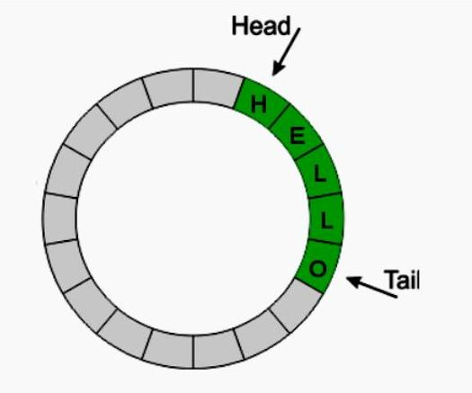

# Задание 4 (кольцевой буфер)

Необходимо реализовать кольцевой буфер следующим образом:

* Работа с кольцевым буфером начинается с его создания и инициализации, поэтому необходимо реализовать функцию `init`. В функцию будет передаваться длина кольцевого буфера (кол-во узлов).

* Далее необходимо реализовать функцию, которая будет записывать новые значения в кольцевой буфер (для значения можно выбрать любой тип данных). Если кольцевой буфер закончился, то старые данные должны перезаписываться новыми. Длина кольцевого буфера изменяться не должна.

* Реализовать функцию для вывода кольцевого буфера в `ostream`. Незаполненные (непроставленные) ячейки кольцевого буфера выводить не нужно.

Требования:

* реализация кольцевого буфера должна быть на односвязном/двусвязном списке (+ указатели)
* линковка

Описание: <https://ru.wikipedia.org/wiki/%D0%9A%D0%BE%D0%BB%D1%8C%D1%86%D0%B5%D0%B2%D0%BE%D0%B9_%D0%B1%D1%83%D1%84%D0%B5%D1%80>
